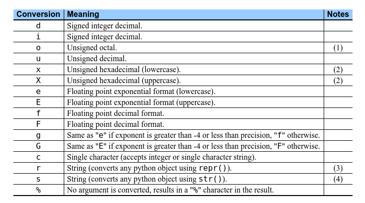

## 补充

### Basic Operators

运算符类型；

- Arithmetic Operators
- Comparison (Relational) Operators
- Assignment Operators
- Logical Operators
- Bitwise Operators
- Membership Operators
- Identity Operators

#### Arithmetic Operators 算术运算符

```
+ - * / % ** //
```

#### Comparison (Relational) Operators 比较符

```
>
>=
<
<=

== 两个等号是判断是否相等，一个等号是赋值
!= 
<>
```

### String Formatting


```python
name = 'James'
age = 33
print("%s is %d years old." % (name, age))
```

%s 字符串  
%d 整型  
%f 浮点数



[link](https://docs.python.org/2.4/lib/typesseq-strings.html)

### Namespaces and Scoping 命名空间和作用域

Variables are names (identifiers) that map to objects.
变量是名字到对象的映射。

A namespace is a dictionary of variable names (keys) and their corresponding objects (values).
命名空间可以理解为名字和对应对象的目录。

local namespace & global namespace

每个函数有自己的局部命名空间，在函数内使用全局变量要加global标志。
如果同名，局部命名空间的变量会覆盖全局命名空间的变量。

```python
Money = 2000 # 全局
def AddMoney():
   # Uncomment the following line to fix the code:
   # global Money
   Money = Money + 1 

print(Money) # 覆盖前
AddMoney()
print(Money) # 覆盖后

```


## classes & objects

**面向对象编程（Object-Oriented Programming, OOP）**


```python
class Employee:
    """所有employee的基类"""

    empCount = 0 # 类变量(Class variable)，被所有实例共享，可以从类的内部和外部通过Employee.empCount访问，不如实例变量常用

    """
    类内部定义的函数叫做类的方法（Method）
    """
    def __init__(self, name, salary):
        """
        实例化一个类的时候会被调用的初始化方法
        """
        self.name = name # 实例变量（Instance vairable），定义在方法内，只属于这个实例
        self.salary = salary
        Employee.empCount += 1
   
    # 定义类方法的时候，注意第一个参数都是self，调用的时候不需要
    def displayCount(self):
        print("Total Employee %d" % Employee.empCount)

    def displayEmployee(self):
        print("Name : ", self.name,  ", Salary: ", self.salary)


# 类的实例化(Instantiation)，实例叫做这个类的对象
# This would create first object of Employee class"
emp1 = Employee("Zara", 2000)
# This would create second object of Employee class"
emp2 = Employee("Manni", 5000)

# 对象属性用点操作符访问'.'
emp1.displayEmployee()
emp2.displayEmployee()
# 类变量的访问
print("Total Employee %d" % Employee.empCount)

# 对象属性可以随时添加，删除，修改
emp1.age = 27  # Add an 'age' attribute.
emp1.age = 28  # Modify 'age' attribute.
del emp1.age  # Delete 'age' attribute.
```

## Modules

使用模块可以从其他python文件导入定义好的类或者函数

两种导入方法
```python
import module_name # 这种方法通过module_name.method的方式访问模块里的方法或者类
from module_name import function
from module_name import *

```

- 例子1-自建模块

```python
from employee import Employee

emp1 = Employee("Zara", 2000)
emp2 = Employee("Manni", 5000)

emp1.displayEmployee()
emp2.displayEmployee()
```

- 例子2-内置模块

```python
import math

print(math.sqrt(9)) #3.0
```

### dir()

输出模块内定义的变量与函数

```python
import math
print(dir(math))

help(math.pow)
```
output：
```
['__doc__', '__loader__', '__name__', '__package__', '__spec__', 'acos', 
'acosh', 'asin', 'asinh', 'atan', 'atan2', 'atanh', 'ceil', 'copysign', 'cos', 
'cosh', 'degrees', 'e', 'erf', 'erfc', 'exp', 'expm1', 'fabs', 'factorial', 
'floor', 'fmod', 'frexp', 'fsum', 'gamma', 'gcd', 'hypot', 'inf', 'isclose', 
'isfinite', 'isinf', 'isnan', 'ldexp', 'lgamma', 'log', 'log10', 'log1p', 
'log2', 'modf', 'nan', 'pi', 'pow', 'radians', 'sin', 'sinh', 'sqrt', 'tan', 
'tanh', 'trunc']

pow(...)
    pow(x, y)
    
    Return x**y (x to the power of y).
```

其中，```__name__```是模块名，在当前文件下```__name__ == 'main'```

- 在use_module文件对比import employee 与 employee2

## Files I/O

### Printing to the screen

最简单的输出，```print(expression1, expression2, ...)```，将几个逗号隔开的表达式以字符的形式输出到 **标准输出**，即屏幕。
