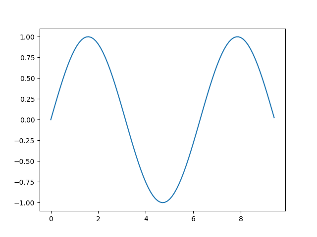
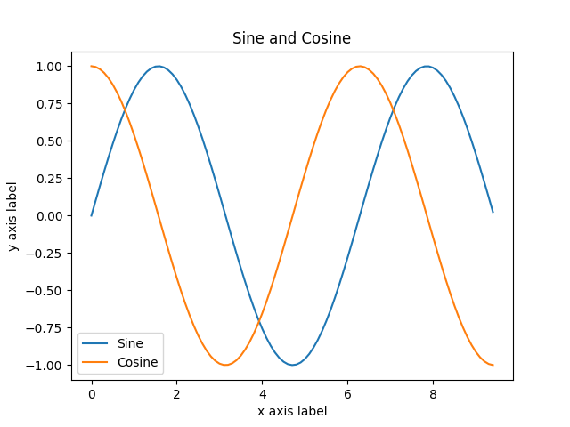
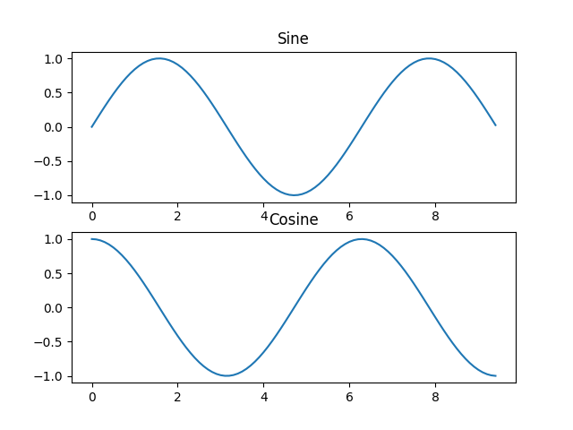
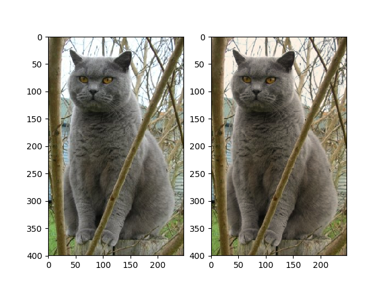

## python科学计算工具介绍

### Numpy简介

[numpy](http://cs231n.github.io/python-numpy-tutorial/#numpy)是一个用于python科学计算的核心库。它提供了高性能的多维数组对象，以及操作这些数组的工具。

#### Arrays

创建numpy array的最简单方法就是传入list

```py
import numpy as np

a = np.array([1, 2, 3])   # Create a rank 1 array 一维
print(type(a))            # Prints "<class 'numpy.ndarray'>"
print(a.shape)            # Prints "(3,)" 
                          # shape是一个很重要的属性，描述了每个维度的大小
print(a[0], a[1], a[2])   # Prints "1 2 3"
a[0] = 5                  # Change an element of the array
print(a)                  # Prints "[5, 2, 3]"

li = [[1,2,3],[4,5,6]]
b = np.array(li)    # Create a rank 2 array 二维
print(b.shape)                     # Prints "(2, 3)"
print(b[0, 0], b[0, 1], b[1, 0])   # Prints "1 2 4" 
                                   # 二维array的索引和二维list的索引有所不同
print(b[0][0], b[0][1], b[1][0])   # Prints "1 2 4" 
```

Numpy 还提供了许多创建array的方法

```py
import numpy as np

a = np.zeros((2,2))   # Create an array of all zeros
print(a)              # Prints "[[ 0.  0.]
                      #          [ 0.  0.]]"

b = np.ones((1,2))    # Create an array of all ones
print(b)              # Prints "[[ 1.  1.]]"

c = np.full((2,2), 7)  # Create a constant array
print(c)               # Prints "[[ 7.  7.]
                       #          [ 7.  7.]]"

d = np.eye(2)         # Create a 2x2 identity matrix 恒等矩阵/单位矩阵
print(d)              # Prints "[[ 1.  0.]
                      #          [ 0.  1.]]"

e = np.random.random((2,2))  # Create an array filled with random values
print(e)                     # Might print "[[ 0.91940167  0.08143941]
                             #               [ 0.68744134  0.87236687]]"
```

#### Array indexing

**slice indexing**

```py
import numpy as np

# Create the following rank 2 array with shape (3, 4)
# [[ 1  2  3  4]
#  [ 5  6  7  8]
#  [ 9 10 11 12]]
a = np.array([[1,2,3,4], [5,6,7,8], [9,10,11,12]])

# Use slicing to pull out the subarray consisting of the first 2 rows
# and columns 1 and 2; b is the following array of shape (2, 2):
# [[2 3]
#  [6 7]]
b = a[:2, 1:3] # 这种索引方法叫做Slicing

# b相当于a的子数组的指针, 对b的修改会影响原始数组a
print(a[0, 1])   # Prints "2"
b[0, 0] = 77     # b[0, 0] 和 a[0, 1] 指向数组里的同一个元素
print(a[0, 1])   # Prints "77"

```

**integer indexing** 与 **slice indexing** 混合

```py
import numpy as np

# Create the following rank 2 array with shape (3, 4)
# [[ 1  2  3  4]
#  [ 5  6  7  8]
#  [ 9 10 11 12]]
a = np.array([[1,2,3,4], [5,6,7,8], [9,10,11,12]])

# integer indexing 与 slice indexing 会生成一个比原数组低维的数组，这一点与MATLAB不太一样
row_r1 = a[1, :]    # integer indexing and slice indexing
row_r2 = a[1:2, :]  # slice indexing only
print(row_r1, row_r1.shape)  # Prints "[5 6 7 8] (4,)" 生成一个低维数组
print(row_r2, row_r2.shape)  # Prints "[[5 6 7 8]] (1, 4)" 与原数组一样，都是二维

# 列索引的时候也一样
col_r1 = a[:, 1]
col_r2 = a[:, 1:2]
print(col_r1, col_r1.shape)  # Prints "[ 2  6 10] (3,)"
print(col_r2, col_r2.shape)  # Prints "[[ 2]
                             #          [ 6]
                             #          [10]] (3, 1)"
```

**integer indexing**

结果总是原数组的一个子数组

```py
import numpy as np

a = np.array([[1,2], [3, 4], [5, 6]])

# An example of integer array indexing.
# The returned array will have shape (3,) and
print(a[[0, 1, 2], [0, 1, 0]])  # Prints "[1 4 5]"
                                # [0, 1, 2] 表示第一维的位置
                                # [0, 1, 0] 表示第二维的位置

# 上述例子等价于下面这个例子:
print(np.array([a[0, 0], a[1, 1], a[2, 0]]))  # Prints "[1 4 5]"
```

选择或者修改矩阵中每一行的某个元素

```py
import numpy as np

# Create a new array from which we will select elements
a = np.array([[1,2,3], [4,5,6], [7,8,9], [10, 11, 12]])

print(a)  # prints "array([[ 1,  2,  3],
          #                [ 4,  5,  6],
          #                [ 7,  8,  9],
          #                [10, 11, 12]])"

# Create an array of indices
b = np.array([0, 2, 0, 1])

# 根据indices b选择矩阵中每一行的相应元素
print(a[np.arange(4), b])  # Prints "[ 1  6  7 11]"

# 根据indices b改变矩阵中每一行的相应元素
a[np.arange(4), b] += 10

print(a)  # prints "array([[11,  2,  3],
          #                [ 4,  5, 16],
          #                [17,  8,  9],
          #                [10, 21, 12]])
```

**Boolean array indexing**

Boolean array indexing 使你能够挑出数组中满足条件的所有元素

```py
import numpy as np

a = np.array([[1,2], [3, 4], [5, 6]])

bool_idx = (a > 2)   # Find the elements of a that are bigger than 2;
                     # this returns a numpy array of Booleans of the same
                     # shape as a, where each slot of bool_idx tells
                     # whether that element of a is > 2.

print(bool_idx)      # Prints "[[False False]
                     #          [ True  True]
                     #          [ True  True]]"

# 输出满足条件的元素
print(a[bool_idx])  # Prints "[3 4 5 6]"

# 也可以一步完成
print(a[a > 2])     # Prints "[3 4 5 6]"
```

#### Datatypes

numpy array里的每个元素必须是同一种类型。创建array的时候，可以指明数据类型。如果没有说明，函数会自动猜测数据类型。指明数据类型是一种更稳妥的做法。

```py
import numpy as np

x = np.array([1, 2])   # Let numpy choose the datatype
print(x.dtype)         # Prints "int64"

x = np.array([1.0, 2.0])   # Let numpy choose the datatype
print(x.dtype)             # Prints "float64"

x = np.array([1, 2], dtype=np.int64)   # Force a particular datatype
print(x.dtype)                         # Prints "int64"

```

More about [numpy datatypes](https://docs.scipy.org/doc/numpy/reference/arrays.dtypes.html)

#### Array math

numpy array经常用到的一种操作是 elementwise operation，也就是对两个数组中所有对应位置的元素进行运算。

```py
import numpy as np

x = np.array([[1,2],[3,4]], dtype=np.float64)
y = np.array([[5,6],[7,8]], dtype=np.float64)

# Elementwise sum; both produce the array
# [[ 6.0  8.0]
#  [10.0 12.0]]
print(x + y)
print(np.add(x, y))

# Elementwise difference; both produce the array
# [[-4.0 -4.0]
#  [-4.0 -4.0]]
print(x - y)
print(np.subtract(x, y))

# Elementwise product; both produce the array
# [[ 5.0 12.0]
#  [21.0 32.0]]
print(x * y)
print(np.multiply(x, y))

# Elementwise division; both produce the array
# [[ 0.2         0.33333333]
#  [ 0.42857143  0.5       ]]
print(x / y)
print(np.divide(x, y))

# Elementwise square root; produces the array
# [[ 1.          1.41421356]
#  [ 1.73205081  2.        ]]
print(np.sqrt(x))
```

与MATLAB不同的是，```*```是按元素乘elementwise multiplication，而不是矩阵乘法。而用```dot```函数计算两个向量的内积，向量乘矩阵，矩阵乘矩阵。

numpy模块的函数以及array对象的实例方法都有```dot```函数

```py
import numpy as np

x = np.array([[1,2],[3,4]])
y = np.array([[5,6],[7,8]])

v = np.array([9,10])
w = np.array([11, 12])

# Inner product of vectors; both produce 219
print(v.dot(w))
print(np.dot(v, w))

# Matrix / vector product; both produce the rank 1 array [29 67]
print(x.dot(v))
print(np.dot(x, v))

# Matrix / matrix product; both produce the rank 2 array
# [[19 22]
#  [43 50]]
print(x.dot(y))
print(np.dot(x, y))
```

numpy模块提供了许多有用的函数，其中最有用的一个是```num```函数
```py
import numpy as np

x = np.array([[1,2],[3,4],[5,6]])

print(np.sum(x))  # Compute sum of all elements; prints "10"
print(np.sum(x, axis=0))  # Compute sum of each column; prints "[9 12]"
print(np.sum(x, axis=1))  # Compute sum of each row; prints "[3 7 11]"
```

更复杂点

```py
import numpy as np

x = np.array([[[1,2],[3,4],[5,6]],[[7,8],[9,10],[11,12]]]) #2,3,2
print(x.shape)

print(np.sum(x))  # Compute sum of all elements; prints "78"
print(np.sum(x, axis=0))  # Compute sum of each column; prints [[ 8 10]
                                                              # [12 14]
                                                              # [16 18]]
print(np.sum(x, axis=1))  # Compute sum of each row; prints [[ 9 12]
                                                           # [27 30]]
print(np.sum(x, axis=2))  # Compute sum of each row; prints [[ 3  7 11]
                                                           # [15 19 23]]
```

numpy的更多[数学函数](https://docs.scipy.org/doc/numpy/reference/routines.math.html)

矩阵转置

```py
import numpy as np

x = np.array([[1,2], [3,4]])
print(x)    # Prints "[[1 2]
            #          [3 4]]"
print(x.T)  # Prints "[[1 3]
            #          [2 4]]"

# Note that taking the transpose of a rank 1 array does nothing:
v = np.array([1,2,3])
print(v)    # Prints "[1 2 3]"
print(v.T)  # Prints "[1 2 3]"
```

#### Broadcasting

Broadcasting 是 numpy 的一个强大机制。

经常，我们有一个小array和一个大array，然后我们想使用小array在大array上执行一些运算。

比如，我们想把一个常数向量加到一个矩阵的每一行上，通常会这样写

```py
import numpy as np

# We will add the vector v to each row of the matrix x,
# storing the result in the matrix y
x = np.array([[1,2,3], [4,5,6], [7,8,9], [10, 11, 12]])
v = np.array([1, 0, 1])
y = np.empty_like(x)   # Create an empty matrix with the same shape as x

# Add the vector v to each row of the matrix x with an explicit loop
for i in range(4):
    y[i, :] = x[i, :] + v

# Now y is the following
# [[ 2  2  4]
#  [ 5  5  7]
#  [ 8  8 10]
#  [11 11 13]]
print(y)
```

这个是可以的，然而，当矩阵```x```特别大的时候，计算循环会变得很慢。

我们注意到把向量```v```加到矩阵```x```的每一行，等价于，先生成一个和```x```相同shape的矩阵```vv```，其中的每一行都是向量```v```，然后再将矩阵```x```和矩阵```vv```相加

```py
import numpy as np

# We will add the vector v to each row of the matrix x,
# storing the result in the matrix y
x = np.array([[1,2,3], [4,5,6], [7,8,9], [10, 11, 12]])
v = np.array([1, 0, 1])
vv = np.tile(v, (4, 1))   # Stack 4 copies of v on top of each other
print(vv)                 # Prints "[[1 0 1]
                          #          [1 0 1]
                          #          [1 0 1]
                          #          [1 0 1]]"
y = x + vv  # Add x and vv elementwise
print(y)  # Prints "[[ 2  2  4
          #          [ 5  5  7]
          #          [ 8  8 10]
          #          [11 11 13]]"
```

通过numpy的broadcasting机制，我们可以省略这些操作。

```py
import numpy as np

# We will add the vector v to each row of the matrix x,
# storing the result in the matrix y
x = np.array([[1,2,3], [4,5,6], [7,8,9], [10, 11, 12]])
v = np.array([1, 0, 1])
y = x + v  # Add v to each row of x using broadcasting 一步搞定
print(y)  # Prints "[[ 2  2  4]
          #          [ 5  5  7]
          #          [ 8  8 10]
          #          [11 11 13]]"
```

broadcasting的一些其他应用

```py
import numpy as np

# Compute outer product of vectors 计算两个向量的外积
v = np.array([1,2,3])  # v has shape (3,)
w = np.array([4,5])    # w has shape (2,)
# To compute an outer product, we first reshape v to be a column
# vector of shape (3, 1); we can then broadcast it against w to yield
# an output of shape (3, 2), which is the outer product of v and w:
# [[ 4  5]
#  [ 8 10]
#  [12 15]]
print(np.reshape(v, (3, 1)) * w)

# Add a vector to each row of a matrix
x = np.array([[1,2,3], [4,5,6]])
# x has shape (2, 3) and v has shape (3,) so they broadcast to (2, 3),
# giving the following matrix:
# [[2 4 6]
#  [5 7 9]]
print(x + v)

# Add a vector to each column of a matrix
# x has shape (2, 3) and w has shape (2,).
# If we transpose x then it has shape (3, 2) and can be broadcast
# against w to yield a result of shape (3, 2); transposing this result
# yields the final result of shape (2, 3) which is the matrix x with
# the vector w added to each column. Gives the following matrix:
# [[ 5  6  7]
#  [ 9 10 11]]
print((x.T + w).T)
# Another solution is to reshape w to be a column vector of shape (2, 1);
# we can then broadcast it directly against x to produce the same
# output.
print(x + np.reshape(w, (2, 1)))

# Multiply a matrix by a constant:
# x has shape (2, 3). Numpy treats scalars as arrays of shape ();
# these can be broadcast together to shape (2, 3), producing the
# following array:
# [[ 2  4  6]
#  [ 8 10 12]]
print(x * 2)
```

### SciPy简介

numpy提供了高性能的多维数组，以及操作这些数组的工具。scipy基于numpy，提供了许多操作numpy数组的函数，在各种科学或者工程应用中十分有用。

[scipy文档](https://docs.scipy.org/doc/scipy/reference/index.html)

主要应用

- Integration (scipy.integrate) 积分
- Optimization (scipy.optimize) 最优化
- Interpolation (scipy.interpolate) 插值
- Fourier Transforms (scipy.fftpack) 傅里叶变换
- Signal Processing (scipy.signal) 信号处理
- Linear Algebra (scipy.linalg) 线性代数
- Sparse Eigenvalue Problems with ARPACK 稀疏特征值问题
- Compressed Sparse Graph Routines (scipy.sparse.csgraph) 
- Spatial data structures and algorithms (scipy.spatial) 空间数据结构与算法
- Statistics (scipy.stats) 统计学
- Multidimensional image processing (scipy.ndimage)多维图像处理


#### Image operations

```py
from scipy.misc import imread, imsave, imresize

# Read an JPEG image into a numpy array
img = imread('../img/cat.jpg')
print(img.dtype, img.shape)  # Prints "uint8 (400, 248, 3)"

# 调整颜色。红绿蓝三个通道分别乘以1,0.95,0.9
img_tinted = img * [1, 0.95, 0.9]

# Resize the tinted image to be 300 by 300 pixels.
img_tinted = imresize(img_tinted, (300, 300))

# Write the tinted image back to disk
imsave('../img/cat_tinted.jpg', img_tinted)
```

original


after processing


#### MATLAB files

函数```scipy.io.loadmat```和```scipy.io.savemat```使你能够读写MATLAB文件。 详见[scipy.io](https://docs.scipy.org/doc/scipy/reference/io.html)

#### Distance between points

计算所有点对之间的距离

```py
import numpy as np
from scipy.spatial.distance import pdist, squareform

# Create the following array where each row is a point in 2D space:
# [[0 1]
#  [1 0]
#  [2 0]]
x = np.array([[0, 1], [1, 0], [2, 0]])
print(x)

# Compute the Euclidean distance between all rows of x.
# d[i, j] is the Euclidean distance between x[i, :] and x[j, :],
# and d is the following array:
# [[ 0.          1.41421356  2.23606798]
#  [ 1.41421356  0.          1.        ]
#  [ 2.23606798  1.          0.        ]]
d = squareform(pdist(x, 'euclidean'))
print(d)
```

### Matplotlib

Matplotlib是一个画图的库。```matplotlib.pyplot```模块提供了一个和MATLAB类似的画图系统。

#### Plotting

```py
import numpy as np
import matplotlib.pyplot as plt

# Compute the x and y coordinates for points on a sine curve
x = np.arange(0, 3 * np.pi, 0.1)
y = np.sin(x)

# Plot the points using matplotlib
plt.plot(x, y)
plt.show()  # 调用这个函数图才会显示
```

output



在一张图里画多条线，并添加标题，图例，和坐标轴标签

```py
import numpy as np
import matplotlib.pyplot as plt

# Compute the x and y coordinates for points on sine and cosine curves
x = np.arange(0, 3 * np.pi, 0.1)
y_sin = np.sin(x)
y_cos = np.cos(x)

# Plot the points using matplotlib
plt.plot(x, y_sin)
plt.plot(x, y_cos)
plt.xlabel('x axis label')
plt.ylabel('y axis label')
plt.title('Sine and Cosine')
plt.legend(['Sine', 'Cosine'])
plt.show()
```

output



更多plot用法详见[文档](https://matplotlib.org/api/pyplot_api.html#matplotlib.pyplot.plot)

#### Subplot

使用```subplot```函数在一张图里画不同的东西

```py
import numpy as np
import matplotlib.pyplot as plt

# Compute the x and y coordinates for points on sine and cosine curves
x = np.arange(0, 3 * np.pi, 0.1)
y_sin = np.sin(x)
y_cos = np.cos(x)

# Set up a subplot grid that has height 2 and width 1, 设置2*1的网格
# and set the first such subplot as active. 开始画第一个网格里的图
plt.subplot(2, 1, 1)

# Make the first plot
plt.plot(x, y_sin)
plt.title('Sine')

# Set the second subplot as active, and make the second plot. 开始画第二个网格的图
plt.subplot(2, 1, 2)
plt.plot(x, y_cos)
plt.title('Cosine')

# Show the figure.
plt.show()
```

output



更多subplot用法详见[文档](https://matplotlib.org/api/pyplot_api.html#matplotlib.pyplot.subplot)

#### Images

使用```plt.imshow```函数可以显示图片

```py
import numpy as np
from scipy.misc import imread, imresize
import matplotlib.pyplot as plt

img = imread('../img/cat.jpg')
img_tinted = img * [1, 0.95, 0.9]

# Show the original image
plt.subplot(1, 2, 1)
plt.imshow(img)

# Show the tinted image
plt.subplot(1, 2, 2)

# A slight gotcha with imshow is that it might give strange results
# if presented with data that is not uint8. To work around this, we
# explicitly cast the image to uint8 before displaying it.
plt.imshow(np.uint8(img_tinted))
plt.show()
```

output




### reference

[http://cs231n.github.io/python-numpy-tutorial/#numpy-datatypes](http://cs231n.github.io/python-numpy-tutorial/#numpy-datatypes)
